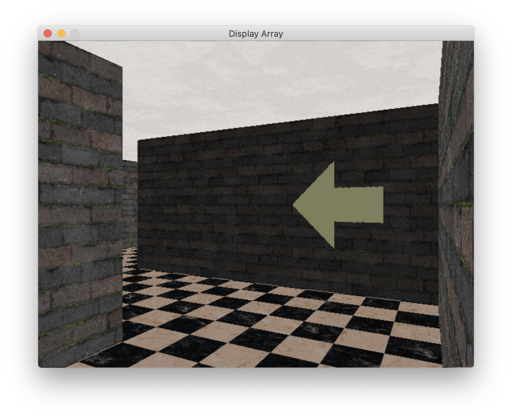

# RaycastWorld

Generate mazes and navigate through them with turn-by-turn directions.




# Requirements

`RaycastWorld/RaycastWorld.cpp` requires `lodepng`, which is included as a submodule.

`PycastWorld/pycaster...` requires `pybind11`, which is included as a submodule.

Download both submodules with the following command (run it from the root of this project):

```bash
git submodule update --init --recursive
```

`Game/Game.cpp` depends on [GLFW3](https://www.glfw.org/). This is **not** included as a submodule. It will need to be installed separately.

`MazeGen/MazeGen.py` depends on NumPy, but this dependency can be avoided if you don't need to view the output.

# Getting Started

Here is the process to get the game up and running (all steps assume you are in the root project directory):

1. Generate a maze using `MazeGen/MazeGen.py`

```bash
MazeGen/MazeGen.py --width 8 --height 8 --out > Mazes/new_maze.txt
```

2. Compile `Game/Game`

```bash
cd Game
make
```

3. Run `Game/Game` with the new maze

```bash
cd Game
./Game ../Mazes/new_maze.txt
```

# Working With Python

Aside from `Game/Game`, you can use the raycasting engine in Python. To do so, you must compile the bindings. The easiest way to do so is to:

```bash
cd PycastWorld
make
```

# Working on the server

When working on `dgx01`:

```bash
/raid/clark/summer2021/
├── datasets
└── models
```

Save all datasets and models into these folders.

Additionally, pleasure help ensure that we provide a consistent interface for each model+dataset combination. We need to make it easy to load and run a model in `Imitator/Imitate.py`. We might need to create an interface for this (i.e., a base class), but I am not sure if that is necessary.

# Working With Notebooks

We will use [mwouts/jupytext: Jupyter Notebooks as Markdown Documents, Julia, Python or R scripts](https://github.com/mwouts/jupytext "mwouts/jupytext: Jupyter Notebooks as Markdown Documents, Julia, Python or R scripts") to more effectively work with Jupyter Notebooks. Each notebook should be paired with a script. This has the following benefits:

- It will make it easier for me to review notebooks.
- It will make it easier for others to make changes to notebooks (e.g., if an API call changes).


# Textures

Textures are from [](https://cc0textures.com/). These are under the Creative Commons CC0 License.

# License

`RaycastWorld/RaycastWorld.cpp` is based heavily on [raycaster_pitch.cpp](https://lodev.org/cgtutor/files/raycaster_pitch.cpp) by Lode Vandevenne. The original file contains this copyright notice.

```
Copyright (c) 2004-2020, Lode Vandevenne

All rights reserved.

Redistribution and use in source and binary forms, with or without modification, are permitted provided that the following conditions are met:

    * Redistributions of source code must retain the above copyright notice, this list of conditions and the following disclaimer.
    * Redistributions in binary form must reproduce the above copyright notice, this list of conditions and the following disclaimer in the documentation and/or other materials provided with the distribution.

THIS SOFTWARE IS PROVIDED BY THE COPYRIGHT HOLDERS AND CONTRIBUTORS
"AS IS" AND ANY EXPRESS OR IMPLIED WARRANTIES, INCLUDING, BUT NOT
LIMITED TO, THE IMPLIED WARRANTIES OF MERCHANTABILITY AND FITNESS FOR
A PARTICULAR PURPOSE ARE DISCLAIMED. IN NO EVENT SHALL THE COPYRIGHT OWNER OR
CONTRIBUTORS BE LIABLE FOR ANY DIRECT, INDIRECT, INCIDENTAL, SPECIAL,
EXEMPLARY, OR CONSEQUENTIAL DAMAGES (INCLUDING, BUT NOT LIMITED TO,
PROCUREMENT OF SUBSTITUTE GOODS OR SERVICES; LOSS OF USE, DATA, OR
PROFITS; OR BUSINESS INTERRUPTION) HOWEVER CAUSED AND ON ANY THEORY OF
LIABILITY, WHETHER IN CONTRACT, STRICT LIABILITY, OR TORT (INCLUDING
NEGLIGENCE OR OTHERWISE) ARISING IN ANY WAY OUT OF THE USE OF THIS
SOFTWARE, EVEN IF ADVISED OF THE POSSIBILITY OF SUCH DAMAGE.
```

# Notes

Things to do:

- add lighting
- add levels (e.g., three levels of cast rays)
- agent height
- skybox
- https://github.com/sizmailov/pybind11-stubgen
- wall heights: for each vertical line
    + cast ray
    + fill from bottom until height
    + repeat until full screen height
- we can use the raycast distances to label pixels for getting depth
- compile to JS and work in browser
- switch to Julia? (pyjulia, juliaimages)

Resources:

- [Possible Python GUI](https://old.reddit.com/r/DearPyGui/comments/jp0upr/load_image_from_numpy/)
- [Raycasting with different height walls](https://stackoverflow.com/questions/47239797/ray-casting-with-different-height-size/)
- [Raycasting tutorial](https://lodev.org/cgtutor/)
- [Raycasting course](https://courses.pikuma.com/courses/raycasting)
- [Generating mazes](https://weblog.jamisbuck.org/2011/2/7/maze-generation-algorithm-recap)
